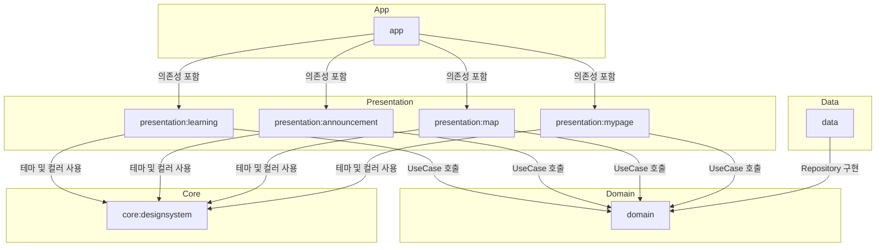

# Saegil-Android

## ↔️ 모듈 구조

## 📌 라이브러리 정리

| 라이브러리          | 용도         | 설명                                                                                             |
|----------------|------------|------------------------------------------------------------------------------------------------|
| **Hilt**       | 의존성 주입(DI) | 객체 생성을 관리하고 주입하여 코드 의존성을 줄이고 테스트를 쉽게 만듦. 싱글톤 관리가 용이하며, 서버 통신, DB, ViewModel 등에 필요한 객체를 자동으로 주입 |
| **Room**       | 로컬 DB 저장   | SQLite 기반의 ORM 라이브러리. 데이터베이스 접근을 간단하게 하고, 타입 안정성을 보장하며, LiveData 및 Flow와 함께 사용 가능              |
| **Coil**       | 이미지 로딩     | Kotlin 기반의 경량 이미지 로딩 라이브러리. Jetpack Compose와의 최적화된 연동이 가능하며, Glide보다 가벼워 메모리 사용량이 적고 성능이 우수함   |
| **Ktor**       | 서버 통신      | Kotlin 친화적인 HTTP 클라이언트 라이브러리. Retrofit2보다 코루틴과의 연동이 더 자연스럽고, WebSocket 및 커스텀 네트워크 설정이 유연하게 가능  |
| **Navigation** | 화면 이동      | Jetpack Navigation 구성요소를 사용하여 화면 전환을 관리. 백 스택 관리 및 인자 전달을 쉽게 처리 가능                             |

**✅ 선택 이유**

- **Coil vs. Glide** → Coil이 Kotlin 기반이라 더 가볍고, Compose와의 궁합이 좋음. Glide보다 메모리 사용량이 적음.
- **Ktor vs. Retrofit2** → Ktor가 코루틴과의 연동이 자연스럽고, REST API뿐만 아니라 WebSocket 및 커스텀 네트워크 설정에도 유연함.  
- **Naver Maps** vs **Kakao Maps** -> 네이버 지도는 Compose 전용 라이브러리를 제공하는 반면, 카카오맵은 Compose 전용 라이브러리가 없어 View 기반으로 작업해야 함.
